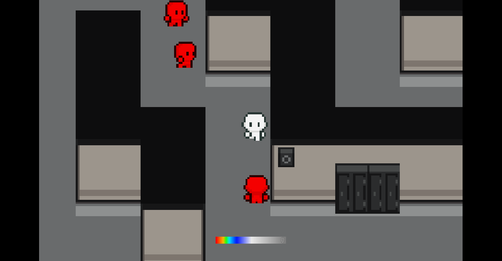

# &#x1F4DA; ***PROJETO DA MNR(A MOSTRA NACIONAL DE ROBÓTICA): LABYRINTH OF BULLIES*** 

O projeto ***Labyrinth of Bullies*** é um jogo desenvolvido através da ***Gogot Engine versão 3.5***, com conexão ao ***Arduino Esplora***, que buscar conscientizar os jovens sobre as diversas consequências que o ***Bullying*** pode causar as suas vítimas.

> ## ***PROJETO***
> O projeto desenvolvido foi o jogo ***Labyrinth of Bullies***, que foi conectado ao ***Arduino Esplora*** com o intuito de torná-lo mais interativo e divertido. O jogo se passa em um labirinto ambientado na escola, onde o jogador tem como objetivo escapar, enquanto é perseguido pelos 'valentões'.

> ## ***FINALIDADE***
> O projeto teve como finalidade conscientizar os jovens sobre as diversas consequências que a prática de ***Bullying*** causa às vítimas e, assim, diminuir a violência no ambiente escolar.

> ## ***AUTORES***
> Os desenvolvedores do projeto foram os alunos do curso de analise e desenvolvimento de sistemas do IFPI, [***Kaio Gabriel***](https://github.com/KaioGabriel-the) e [***Arthur***](https://github.com/ArthurV10), juntamente com Laboratorio [***LABIRAS(Laboratório de Robótica, Automação e Sistemas Inteligentes)***](https://github.com/LabirasIFPI).
